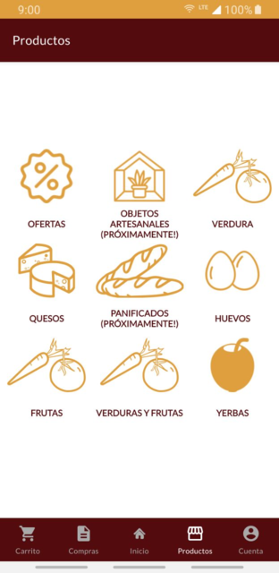

# App "El Paseo"

Aplicación Android realizada para la Organización ["El Paseo"](https://www.instagram.com/paseo.unlp/) destinada a la materia Laboratorio de Software en el año 2020.

## Objetivo

Dado el contexto que atraviesa el mundo (covid 19), el proyecto en desarrollo intentará simplificar la interacción entre los clientes y los productos de la organización **"El Paseo"**.

Principalmente, es necesario cubrir cuestiones relacionadas a la venta de los productos por parte de la organización. El sistema debería poder mostrar de una manera ordenada la mayor cantidad de productos posible. Luego, permitir realizar la compra de dichos productos. Se espera que el sistema sea rápido y fácil de navegar.

Las compras pueden ser retiradas en la sede o atendidas por repartidores, los cuáles se encargarán de realizar las entregas. Para eso los repartidores deben ser notificados mediante el sistema.

Por lo tanto, la aplicación tendrá 2 tipos de usuarios:

- ***Usuario consumidor***: Comprarán los productos ofrecidos por la organización mediante el catálogo de productos.
- ***Usuario repartidor***: Repartirán los productos que fueron comprados por el usuario consumidor, los pedidos serán tomados a través de una lista global en dónde figurarán las compras pendientes que se deben entregar a los clientes.

La **app** facilitará:

- La compra y la obtención de los productos para los clientes.
- La visibilidad de los productores y sus productos.
- Seguimiento del pedido tanto para el consumidor, como para el repartidor.

## Funcionalidades

### 1. Registración del usuario

La aplicación le permite al usuario registrarse

### 2. Elección del producto

La aplicación permite navegar entre productos a través de un listado organizado por categorías:

### 3. Compra del producto

Una vez seleccionados los productos, el usuario puede seleccionar la opción para añadir al carrito los que desee:

Luego, al presionar el botón "comprar" se le abrirá un formulario en dónde deberá rellenar los siguientes campos:

#### 3.1 Método de pago

Le permite al usuario seleccionar un pago con efectivo o con tarjeta de crédito:

#### 3.2 Método de entrega

Luego, el usuario deberá elegir si retirar su pedido en un local u optar por un delivery:

#### 3.3 Información extra

Se le da al usuario la posibilidad de indicar una propina o alguna observación sobre el pedido realizado:

#### 3.4 Confirmación de compra

Se le muestra el resumen de compra al usuario, para que luego pueda confirmar el pedido:

